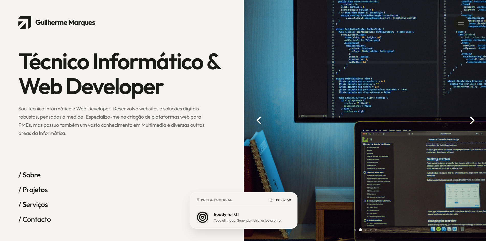

  
  
    

  # Guilherme Marques | Portfólio Digital
  
  **Técnico Informático • Arquiteto de Experiências Digitais • Web Developer**

  

    O meu portfólio pessoal e catálogo de projetos. Uma experiência imersiva construída de raiz com rigor técnico, otimização extrema e foco absoluto em UI/UX.
  

---

## Sobre o Projeto

Este website não é apenas uma montra para os meus trabalhos; é, por si só, uma demonstração prática do meu nível técnico. 

A arquitetura, o design da interface (UI), as experiências de utilização (UX) e todo o código-fonte foram **100% idealizados e desenvolvidos por mim**, sem qualquer recurso a construtores visuais de websites ou templates pré-feitos. A minha filosofia assenta na harmonia entre a estética e o desempenho técnico.

## Destaques e Funcionalidades

- **Desenvolvimento "From Scratch"**: Programado de raiz com foco na pureza do código para garantir a máxima performance.
- **Design de Excelência**: Abordagem visual direcionada para reter a atenção do utilizador através de micro-interações, tipografia moderna e layouts expansivos.
- **Transições SPA (Single Page Application)**: Navegação fluida entre páginas sem carregamentos visíveis, suportada por animações cinematográficas de saída e entrada.
- **Performance Otimizada**: Utilização integral de recursos visuais no formato `.webp`, otimização de carregamento e renderização através de `Intersection Observers` e minimização do impacto no DOM.
- **Design Responsivo Extremo**: Totalmente adaptado não só para dispositivos móveis e tablets, mas também desenhado para suportar proporções de ecrã altamente atípicas em computadores, assegurando que a estrutura se mantém intacta em qualquer cenário.

## Tech Stack

Para assegurar o controlo total sobre cada detalhe visual e interação, o portfólio baseia-se num stack tecnológico minimalista e nativo:

- **Frontend Core**: HTML5 Semântico, CSS3 (Vanilla) e JavaScript (Vanilla ES6+).
- **Animações**: Custom Keyframes, Intersection Observers dinâmicos e scripting personalizado para transições complexas.
- **Design Visual**: Desenho estrutural e conceptual (Figma), manipulação fotográfica e edição vetorial.

## Como Explorar

Sinta-se à vontade para navegar no website através do link publicado, ou clonar este repositório para analisar em detalhe a estrutura do código e as soluções arquiteturais adotadas.

> **Nota**: Todo o conteúdo visual referente a projetos de clientes ("Casos Reais") apresentado neste portfólio encontra-se devidamente autorizado e publicado com o propósito exclusivo de demonstração técnica de serviços.

---

   
  <b>Design e Desenvolvimento por <a href="https://github.com/GJCMarques">Guilherme Marques</a></b>
   
  <i>"A unir a tecnologia e a visão de negócio."</i>

